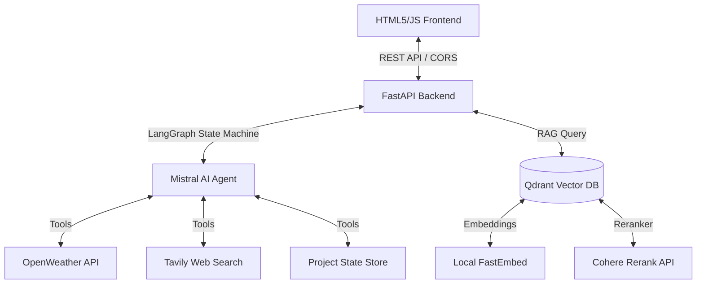

# Construction Intelligence Hub: Implementation Documentary

This documentary outlines the engineering choices, system architecture, feature-by-feature implementation details, and final conclusions of the AI Construction Intelligence Hub project.

---

## 1. Executive Summary
The goal of this project was to transform a standard static dashboard for a construction command center into an **AI-powered predictive control hub**. All metrics (schedule performance index, cost performance index, safety, workforce, and materials) are linked and updated dynamically in response to real-world events. An integrated AI Copilot allows the principal architect (John Doe) to query specifications and drawings, perform real-time web searches, fetch live weather forecasts, and trigger automated cross-module state corrections.

---

## 2. System Architecture
The application runs on a decoupled client-server architecture:

- **Frontend**: A highly responsive vanilla HTML5, CSS3, and JavaScript SPA leveraging Tailwind CSS, GSAP for animations, Chart.js for visualization, and Lucide for iconography.
- **Backend**: Built with Python FastAPI to ensure fast, asynchronous request processing.
- **AI Agent Orchestration**: Implemented using a **LangGraph State Machine** to manage message histories and conditionally route agent calls through external tool functions.
- **Vector Database (RAG)**: Uses **Qdrant** in local persistent mode (`./qdrant_db`) to store and query construction documents, using **FastEmbed** for local dense embedding generation and **Cohere Reranking** to refine similarity matches.

---

## 3. Implemented Features & Integrations

### A. RAG Document Ingestion & Querying
- **What was implemented**:
  - `POST /api/upload`: Handles file uploads (PDF, XLSX, CSV, TXT, CAD metadata). Extracts text contents, splits them into logical chunks, embeds them locally, and stores them in Qdrant.
  - `vector_store_retrieval`: A LangGraph-bound tool that lets the Copilot search across specifications and blueprints to answer structural or architectural questions.
  - Automatically runs an initial AI scan on newly uploaded documents to highlight clashes (e.g. HVAC vs. structural beam conflicts).

### B. Dynamic Setup Wizard
- **What was implemented**:
  - Onboarder that captures baseline attributes (type, area, schedule, shifts).
  - Triggers `POST /api/init-project` to reset the database and load sector-specific materials/equipment (e.g. Prestressed Concrete Beams for Infrastructure projects).

### C. Live AI Copilot
- **What was implemented**:
  - Persistent chat panel at the bottom of the interface.
  - Multi-turn conversation processing via `/api/chat`.
  - Tool binding: Agent can dynamically call weather lookups, web searches, vector store queries, and database updates before replying to the user.

### D. Cross-Module Simulation Engine
- **What was implemented**:
  - `POST /api/simulate-event`: Automatically alters the database parameters to simulate external shocks (e.g. rainstorms or steel shortages).
  - Propagates changes:
    - **Weather Event**: Sets crane to idle, sets crane utilization to 10%, logs crane safety risk, generates danger alert, and lowers schedule performance index (SPI).
    - **Material Shortage**: Lowers cost performance index (CPI), reduces rebar stock levels, changes status to "Shortage Risk", and appends delay alerts.

---

## 4. Engineering Conclusions & Benefits
- **Zero-Infrastructure Local Setup**: Utilizing local Qdrant and local FastEmbed ensures the entire application can run on developer machines without requiring a cloud-hosted database.
- **Integrated Intelligence**: By routing simulation events and chats through a unified database structure, updates in one module immediately reflect visually on all other screens.
- **Robust Tool routing**: The combination of FastAPI and LangGraph enables flexible extension: adding new tools in the future only requires defining a new function in `app.py`.
